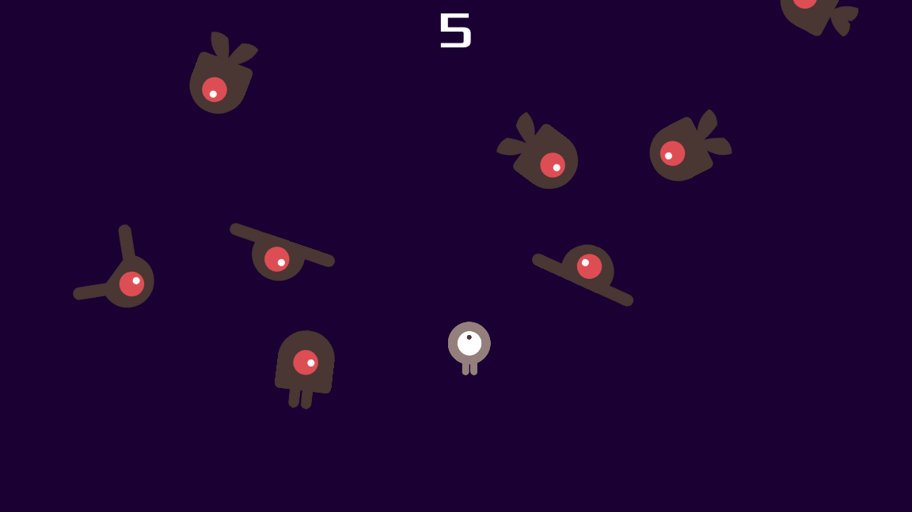

# Dodge the Creeps

跟著 [Godot 4 官方 tutorial](https://docs.godotengine.org/en/stable/getting_started/first_2d_game/index.html)
完成的 2D 閃避小遊戲，作為 6 個月「前端轉 Godot」學習計畫 W2 練習。

> 學習路徑紀錄：[godot-learning-path](https://github.com/asd23353934/godot-learning-path)



## 玩法

- **方向鍵**：移動玩家
- **Enter / Space / 點 Start**：開始
- 閃避從畫面四邊飛來的敵人，撐越久分數越高
- 撞到敵人 → Game Over

## Tech Stack

- **Engine**：Godot 4.6.3 (Standard)
- **語言**：GDScript
- **平台**：Windows（理論上跨平台，未做 export）

## 涵蓋的 Godot 概念

| 模組 | 用到的 node |
|---|---|
| 玩家 | `Area2D` + `AnimatedSprite2D` + `CollisionShape2D` |
| 敵人 | `RigidBody2D` + `VisibleOnScreenNotifier2D` |
| 主場景 | `Path2D` + `PathFollow2D` + `Marker2D` + `Timer` × 3 |
| UI | `CanvasLayer` + `Label` + `Button` + `Theme override` |
| 音效 | `AudioStreamPlayer` × 2 |
| 背景 | `ColorRect` 撐滿錨點 |

## 程式設計 pattern

- **場景組合**：每個 `.tscn` 是可重用組件（Player / Mob / HUD 獨立 scene）
- **Signal up + method down**：child 用 signal 通知 parent，parent 直接 call child method
- **`@export` 注入**：Main 的 `mob_scene: PackedScene` 從 Inspector 拖入，非寫死 preload
- **動態 instantiate + add_child**：runtime 生 Mob，`queue_free` 自我清理
- **`await signal`**：HUD `show_game_over` 用 async pattern 做時序

## 專案結構

```
dodge-the-creeps/
├── main.tscn / main.gd       # 主場景 + 遊戲流程
├── player.tscn / player.gd   # 玩家
├── mob.tscn / mob.gd         # 敵人（隨機 fly / swim / walk）
├── hud.tscn / hud.gd         # UI
├── art/                      # sprite + 音樂
└── fonts/                    # Xolonium-Regular.ttf
```

## 執行方式

1. 安裝 [Godot 4.x Standard](https://godotengine.org/download)
2. clone 此 repo
3. 開 Godot Project Manager → 匯入 → 選此資料夾的 `project.godot`
4. F5 跑遊戲

## License

- 程式碼：MIT
- Assets（art / fonts）：來自 Godot 官方 tutorial，授權見 `fonts/LICENSE.txt`
